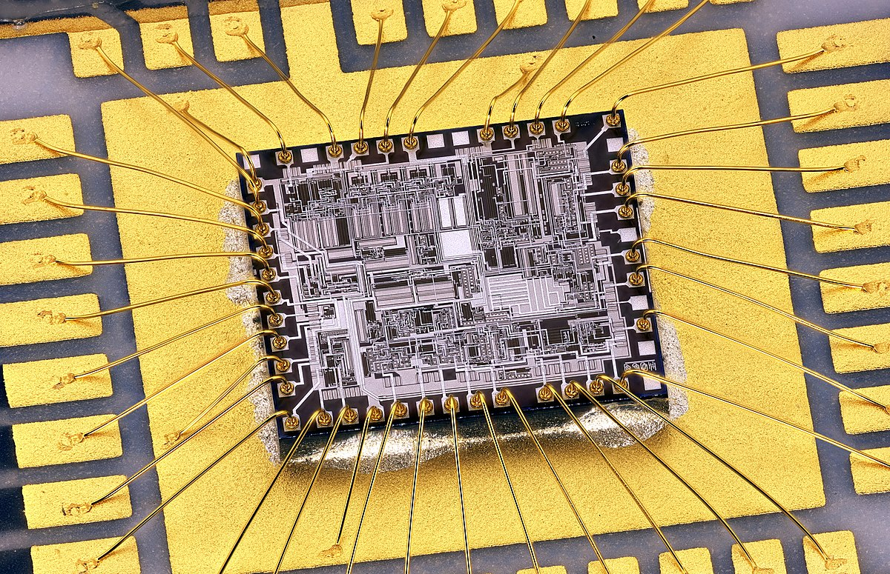
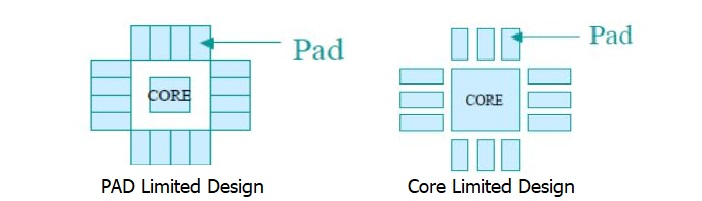
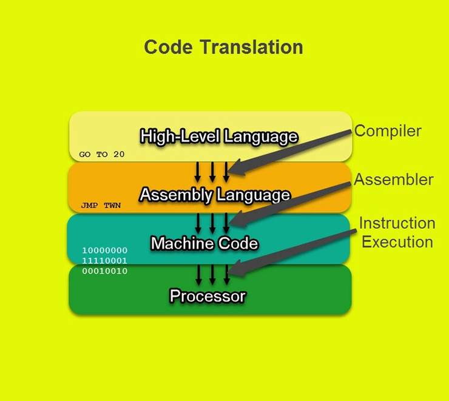
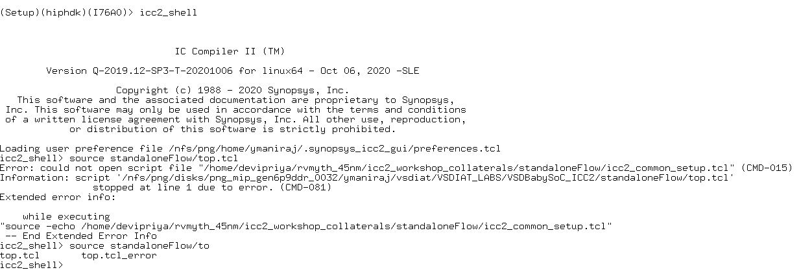

# SD Training 
Content of training:
- [Day_0 : System/Tool Setup Check. GitHub ID creation](https://github.com/YishenKuma/sd_training/edit/main/readme.md#day_0--systemtool-setup-check-github-id-creation)

> - [Lecture_0](https://github.com/YishenKuma/sd_training/blob/main/readme.md#lecture-topics)
> - [Lab_0](https://github.com/YishenKuma/sd_training/blob/main/readme.md#lab-session)

- [Day_1 : Introduction to iverilog design test bench](https://github.com/YishenKuma/sd_training/blob/main/readme.md#day_1--introduction-to-iverilog-design-test-bench)

> - [Lecture_1 + VSD-IAT recording topics](https://github.com/YishenKuma/sd_training/blob/main/readme.md#lecture--vsd-iat-recordining-topics)
> - [Lab_1](https://github.com/YishenKuma/sd_training/blob/main/readme.md#lab-day_1)

- [Day_2: Timing, Hierarchical vs Flat synthesis, and Efficient flop coding style](https://github.com/YishenKuma/sd_training/blob/main/readme.md#day_2--timing-hierarchical-vs-flat-synthesis-and-efficient-flop-coding-style)

> - [Lecture 2 + VSDIAT recordings](https://github.com/YishenKuma/sd_training/blob/main/readme.md#lecture--vsd-iat-recordining-topics-1)
> - [Lab 2](https://github.com/YishenKuma/sd_training/blob/main/readme.md#lab-day_2)

- [Day_3: Combinational and sequential optimizations](https://github.com/YishenKuma/sd_training/blob/main/readme.md#day_3--combinational-and-sequential-optimizations)

> - [Lecture 3 + VSDIAT recordings](https://github.com/YishenKuma/sd_training/blob/main/readme.md#lecture--vsd-iat-recordining-topics-2)
> - [Lab 3](https://github.com/YishenKuma/sd_training/blob/main/readme.md#lab-day_3)

- [Day_4: GLS/Blocking vs Non blocking Assignments and synthesis simulation mismatch](https://github.com/YishenKuma/sd_training/blob/main/readme.md#day_4-timing-hierarchical-vs-flat-synthesis-and-efficient-flop-coding-style)

> - [Lecture 4+ VSDIAT recordings](https://github.com/YishenKuma/sd_training/blob/main/readme.md#lecture-4--vsd-iat-recordining-topics)
> - [Lab 4](https://github.com/YishenKuma/sd_training/blob/main/readme.md#lab-day_4)

- [Day_5: DFT](https://github.com/YishenKuma/sd_training/blob/main/readme.md#day_5--dft)

- [Day_6: Introduction on logic synthesis](https://github.com/YishenKuma/sd_training/blob/main/readme.md#day_6--introduction-on-logic-synthesis)

> - [Lecture 6 + VSDIAT recordings](https://github.com/YishenKuma/sd_training/blob/main/readme.md#lecture--vsdiat-recording-topics)
> - [Lab 6](https://github.com/YishenKuma/sd_training/blob/main/readme.md#lab-day_6)

- [Day_7: Basic SDC Constraints](https://github.com/YishenKuma/sd_training/blob/main/readme.md#day_7--basic-sdc-constraints)

> - [Lecture 7 + VSDIAT recordings](https://github.com/YishenKuma/sd_training/blob/main/readme.md#lecture--vsdiat-recording-topics-1)
> - [Lab 7](https://github.com/YishenKuma/sd_training/blob/main/readme.md#lab-day-7)

- [Day_8: Advanced SDC Constraints](https://github.com/YishenKuma/sd_training/blob/main/readme.md#day_8--advanced-sdc-constraints)

> - [Lecture 8 + VSDIAT recordings](https://github.com/YishenKuma/sd_training/blob/main/readme.md#lecture--vsdiat-recording-topics-2)
> - [Lab 8](https://github.com/YishenKuma/sd_training/blob/main/readme.md#lab-day-8)

- [Day_9: Optimization in synthesis](https://github.com/YishenKuma/sd_training/blob/main/readme.md#day_9--optimizations-in-synthesis)

> - [Lecture 9 + VSDIAT recordings](https://github.com/YishenKuma/sd_training/blob/main/readme.md#lecture--vsdiat-recording-topics-3)
> - [Lab 9](https://github.com/YishenKuma/sd_training/blob/main/readme.md#lab-day-9)

- [Day_10: QOR](https://github.com/YishenKuma/sd_training/blob/main/readme.md#day_10--qor)

> - [Lecture 10 + VSDIAT recordings](https://github.com/YishenKuma/sd_training/blob/main/readme.md#lecture--vsdiat-recording-topics-4)
> - [Lab 10](https://github.com/YishenKuma/sd_training/blob/main/readme.md#lab-day-10)

- [Day_11: Introduction to BabySoC](https://github.com/YishenKuma/sd_training/blob/main/readme.md#day_11--introduction-to-babysoc)

- [Day_12: BabySoC Modelling](https://github.com/YishenKuma/sd_training/blob/main/readme.md#day_12-babysoc-modelling-)

> - [Lecture 12](https://github.com/YishenKuma/sd_training/blob/main/readme.md#lecture-day-12)
> - [Lab 12](https://github.com/YishenKuma/sd_training/blob/main/readme.md#lab-day-12)

- [Day_13: Post Synthesis Simulation](https://github.com/YishenKuma/sd_training/blob/main/readme.md#day_13-post-synthesis-simulation)

> - [Lecture 13](https://github.com/YishenKuma/sd_training/blob/main/readme.md#lecture-day-13)
> - [Lab 13](https://github.com/YishenKuma/sd_training/blob/main/readme.md#lab-day-13)

## **Day_0 : System/Tool Setup Check. GitHub ID creation** 

### Lecture Topics

* Chip and Package
<!---

--->
 

Chip: The assembly of active and passive electronic components, along with their inetrconnections, fabricated as a single unit on a thin substrate of semiconductor material.

Package: The housing that chips are placed in. The package is then either plugged into or soldered onto the printed circuit board. 

* Wire bonding
<!---

--->

Wire bonds are the interconnections between an integrated circuit (IC) or other semiconductor device and its packaging during semiconductor device fabrication.

* Core and IO
<!---

--->

Core: the section of the chip where the fundamental logic of the design is placed (Macros, IPs, Etc,.)

IO: allows the communication of data between die and external components

IO Pads: acting as gateway, connecting internal signals from the core of the integrated circuit to the external pins of the chip package

* Macros and IPs
<!---

--->

Macros: Simple custom built cell serving a sepecific funtional purpose that can be found through open sources

Foundry IPs: Macro cells developed with the intent of licencing to multiple vendor for using as building blocks in different chip designs, known as Intellectual Property 

* Communication between software and hardware
<!---

--->
 

Compiler: reads the complete source program written in high-level language as a whole in one go and translates it into an equivalent program in assembly language

Assembler: translate the program written in assembly language into machine code represented by binary code

### Lab session

#### Steps

[Setup](https://github.com/YishenKuma/sd_training/blob/main/scripts/github_lab0.txt)

#### Results

<!---

--->
 

> error encountered after source standaloneHome/top.tcl

## **Day_1 : Introduction to iverilog design test bench** 

### Lecture + VSD-IAT recordining Topics 

* RTL

RTL refers to Register Transfer Level, a design abstraction that models a circuit in terms of the flow between signals and the logical operations performed

* Verilog HDL

Verilog Hardware Description Language (HDL) is a language used to describe the behaviour of a circuit.

* RTL Deisgn

The behavioural representation of the required specification, written in verilog HDL

RTL design is checked and verified using simulator for adherence to spec by simulatind the design

* iverilog

iverilog is the tool used for simulating the design, to verify the intent of design

the simulator acts by identifying changes in the input signal and evaluating the output based on changes identified from the input
output file dumped out is known as the vcd (value change format) file, to be viewed in gtkwave tool

* gktkwave

gtkwave is a waveform analyzer tool primarily used for visualization

* Design

Design is the verilog code/codes which has the intended functionality meeting the required specification

* Testbench

testbench applies test vectors to the design to check its functionality

checks wether design is obeying to the required specifications

* Verilog files

design verilog file will need to have an associated testbench_design verilog file to be loaded into iverilog

design and testbench file will have a one to one coorespondance

* Library files

the library file is a collection of modules containinga a variety of standard cells

* Logic synthesis

Synthesizer is the tool used to convert RTL into a netlist

The synthesizer maps the RTL code with the digital logic circuit,using a given library file, to generate a netlist

* Netlist

Design is converted into gates and the connections are made between the gates, this file is given out as the netlist

The netlist can then be verified with the cooresponding testbench through the simulator

* Clock timing and frequency claculation

The library file used in generating a netlist has a different sets of standards cells with variying speeds due to the combinational delay in circuit

Combinational delay in the logic path determines the maximum speed of operatiom of the logic circuit

Because the circuit is affected by setup and hold timings, we need to have a variety usage of cells

* Setup and Hold 

Setup time refers to the time needed for data at input, to become stable before the active edge of clock

Hold time refers to the time needed for data at input, to become stable after the active edge of clock

* Selection of cells

We need cells to work fast to meet the required performance, but will sacrifice power and area
But, to handle hold issues that may be present, we need to have cells that work slow, which will also cause circuit to be sluggish
Guidance is needed for the synthesizer to select the appropriate cells for optimum implementation of the logic circuit, this guidance is offered though the use of constraints 

### Lab Day_1

remote spark ubuntu terminal for coding

cloning github repo in vlsi directory

loading verilog files into simulator, and executing output vcd file for viewing in gtkwave

verilog file used and corresponding testbench file used

loading yoysy softqware to be used for synthesis

reading library and verilog files, then performing synthesis using command "synth -top good_mux"

generating the netlist using command "abc -liberty *lib_path*"

shows graphical representation of realized logic

verilog file written from netlist produced

simplified verilog file written using the -noattr switch 

## **Day_2 : Timing, Hierarchical vs Flat synthesis, and Efficient flop coding style** 
### Lecture + VSD-IAT recordining Topics 
* Fundamental of CMOS

complementary metal-oxide semiconductor 

used for constructing integrated circuit (IC) chips

the outputs of the PMOS and NMOS transistors are complementary to create an inverting output

* Setup and Hold time

Setup Time is the time that the input data signals need to become stable before the active clock edge occurs

Hold Time is the time that the input data signals need to become stable after the active clock edge occurs

* .Lib

Collection of standard cells

The naming of the library includes the specific process (typical/nominal/..), temperature and voltage for the design.

The libraries created are characterized to model the variations in the process, voltage and temperature (PVT)

The variations in the process, temperature and voltage of design determines how the design will operate, and the design should be able to operate across all corners 
with the regard to difference in PVT

The library specifies on needed information for the cell mapping such as the technology, delay model, units of measurements, operating conditions , etc,.

The library holds a variety of cells along specified features of the cells such as leakage power, area, signal used for pins, and features of the cell pins.

Each combination of input that produce a unique output will have a specific leakage power.

Variations of the same types of cells will also have unique features associated.

* Hierachical and Flat Representation

Hierarchical design shows design elements as sub-modules within “top module” rather than seeing the instantiation of gates as in flat synthesis

In a flattened “flat netlist” the hierarchies are flattened, showing all the cells used in the whole design, which is the complete structure, rather than in sub module form

* Sub module synthesis

we perform sub module synthesis when we have multiple instances of same module, or when the design is too complex that it would be better to divide the design into sub modules to be synthesized individually

* Stacked PMOS vs Stacked NMOS

Occasionally library elements may result in the design of a stack PMOS during synthesis

This is undesirable as stacked PMOS due to its poor mobility, therefor during synthesis the logic can be restructured to use other components to create the same logic but under a stacked NMOS

E.g. use of OR gate replaced with NAND gate and INV cells

* Gltches

Glitches are unwanted pulses at the output of combinational gates

These glitches occur due to unbalanced delay to the combinational gates

The glitch at one gate can then be feed into the following component causing the later resulting output net to be extremely glitchy and causing high dynamic power consumption.

* Flops

The presence of flops acts to shield the proceeding elements from being affected by the undesired glitch, as the clock signal is unaffected from data signals and glitches

The clock pin will allow the value to stay stable, and therefor avoid undesired glitches in the proceeding elements

The flops need to be initialized for the combinational circuit to have its desirable output

The flop is initialized through its control pins (Reset | Set)

* Asynchronous vs Synchronous

Asynchronous flops means the output of the circuit will be triggered from the rising edge of the set/reset signal, in addition to the rising edge of the clock signal

Synchronous flops means the output of the circuit will be triggered solely on the rising edge of the clock signal, a rising edge in the set/reset pin will not prompt data to be captured

### Lab Day_2

* Top module synthesis

> Library elements used in sub modules

* flattened module synthesis

* sub module synthsis

* Asynchronous reset flop

> data at q can either change at the rising egde of clock or set signal

> if set pin is toggeled high, the q will turn high as well

> when set pin is low, the q pin will be equal to d pin at the rising edge of clock signal

* Asynchronous set flop

> data at q can either change at the rising egde of clock or set signal

> if set pin is toggeled high, the q will turn high as well

> when set pin is low, the q pin will be equal to d pin at the rising edge of clock signal

* Synchronous flop

> q pin will only changes upon rising clock edge, and not on rising edge of reset pin

> if reset pin is high during active clock edge, then q will be set to 0

* Efficient coding style

> no cells getting mapped during synthesis

> 3 bit data getting multiplied without addition cells by adding zero bit/bits or with using own data

> multiplying by 2: 111(7) + 0 = 1110(14)

> multiplying by 4: 111(7) + 00 = 11100(28)

> multiplying by 8: 111(7) + 000 = 111000(56)

> multiplying by 9: 111(7) + 00 = 111111(63)

## **Day_3 : Combinational and sequential optimizations** 

### Lecture + VSD-IAT recordining Topics 

* Nature of synthesis and optimization

Synthesis is not a push button solution

It is dependant on the design statement and clarity of implementation

Some areas will have been applied optimization strategies, and some wont

An area or can be flagged for high effort optimization or set to don’t touch status

The more the design is affected by tool methodologies, the more likely it is to divert from the original design intent

* Optimization methodology

The synthesis tool will perform optimization by minimizing cost functions (design rule costs and optimization costs)

Cost functions vary depending on the EDA tool vendor

Optimization of a design will be an iterative process, as the results of synthesis are dependant on multiple factors such as libraries, constraints and coding styles

Optimizations costs = max delay cost + min delay cost + max power cost + max area cost (most important to least important, may vary depending on EDA vendor)

* Boolean Algebra basics

Boolean algebra constitutes a majority of the combinational optimization

de morgan rule is used to transfor or gate into inverting nand gate, as or gate uses stacked pmos which is undesirable

* Combinational and Sequential Optimization

Constant propagation is the simplification of a combinational circuit through boolean minimization, allowing less components to used Constant propagation occurs for both combinational and sequential logic

Synthesis optimization also allows improvement on circuit delay, as timing constraints may not be met with original logic, thus circuit is optimized by the tool to reduce gate count and minimize delay to value within expectation 

Constant propagation in combinational logic is based on Boolean algebra, whereas for sequential constant propagation, it is dependant on Boolean algebra and timing diagram analysis

One of the additional optimization techniques is known as resource sharing, common inputs would be eliminated, which would also increase the number of fanouts, leaving the overall logic to be distorted in comparison to the original logic intent

Boundary optimization is another technique used, where the boundaries inside top level design are optimized, the constants are pushed into and out of hierarchy, and rewires feed throughs and complementary signals

Register retiming can also be done by readjusting the combinational logic, allowing the overall operating frequency to be increased

State optimization is the optimization of unused gates

Cloning is a physical aware optimization that decreases the load of heavily loaded cell by replicating the cell

### Lab Day_3

#### Combinational Logic Optimization

verilog files used for combinational logic optimizations

> evaluating the boolean logic for the first 4 verilog files

opt_check:

> based on logic, an and gate is used

opt_check2:

> based on logic, an or  gate is used

opt_check3:

> based on logic, 3 input and gate is used

opt_check4:

> based on logic, and xnor gate is used, and input b is not used for output

multiple_module_opt:

> based on logic, input a is fed into submodule 1 with high pin, logic in verilog shows submodule 1 as an and gate

> the output (based on boolean should be a.1=a) will be fed as n1

> sub module 2 is removed in design during "synth -top" as output n2 is not initiallised in assigned logic y = c | (b & n1)

> n1 b and c are fed into an and or gate (b and a through and gate, the output and c through or gate)

#### Sequential Logic Optimization

dff_const1: 

> while reset pin is high, Q is low

> if reset toggeled to zero, q will not immediately switch to high, but only once triggered by positive edge of clock

dff_const2: 

> while set pin is high, Q is high

> since input D is set high, if set is toggeled to low, the value remians high even as triggered by clock, as q = d

dff_const3: 

> two flops used where the output of teh first is fed into the second

> output of first flop is similar to dff_const1

> the second flop out put stays high while set is high, once set is low, it will latch to the immdieate value of Q1, but due to delay, the value will be low, until it becomes high at the next positive edge

dff_const4: 

> first flop behave similar to dff_const2, where output is high only

> second flop replicates this behaviour as well as its input Q1 is always high, so output q will also be always high

dff_const5: 

> output of first flop is similar to dff_const1

> second flop also replicates the behaviour, but since its input is Q1, which toggels from low to high, Q must also toggle from low to high

> reason as to why both flops do not go high at the same time at the first positive clock edge after reset goes low, is because of the delayed capture of data at input, thus value is low until proceeding positive clock edge  

#### Unused Output Optimization

Counter_opt:

> for this case, the output is assigned the final bit of count, and the first 2 bits would not have any significance on the output

> whenever count is increased, the final bit is toggeled, and since the output has no dependancies on the first 2 bits, they are unused outputs

> this case is also only using 1 dff, insetad of 3 as supposed when using 3 bit counter, but since there are 2 unused outputs, they are optimized off

> the input of flop will just be the inverted output of the flop

Counter_opt2:

> in this case, our output is assigned as 3'b100

> now, we intiallize the design to use all the outputs, thus the 3 bit counter is implemented with 3 flops in the design

> we have a large amount of logic within the design for the use of the adder circuit, since the first 2 bits are used, the logic will be used

> at the output, we have inverted inputs !2!1!0, fed into a nor gate with an inverted C pin, thus the inputs are 2!1!0 ~= 3[3'b100]

## **Day_4: Timing, Hierarchical vs Flat synthesis, and Efficient flop coding style** 
### Lecture 4 & VSD-IAT recordining Topics 
#### Gate level simulation

Running test bench with netlist, instead of the RTL, as Design Under Test

Since netlist is logically same to the RTL code, same test bench will align with the design

Map the appropriate technology parameters from library models at hand, to the synthesized netlist, thus allowing simulation of the netlist

Can be used in dynamic timing analysis as it can take in account various clocks and resets simultaneously, and give insight on the asynchronous performance that STA is not meant for

The reason we run GLS is to verify the correctness of design after synthesis, and ensuring the timing of design is met (GLS run with delay annotation)

> https://www.electronicsforu.com/electronics-projects/gate-level-simulation-increasing-trend

#### GLS using iverilog

Design now (netlist not RTL) contains all the standard cells instantiated

Gate level Verilog models now read and given to the tool to produce the vcd file to be viewed in gtkwave

#### Netlist vs Gate level verilog models

Gate level Verilog models allow for functional and timing-aware validation

The necessity in performing functional validation is due to the synthesis and simulation mismatches

#### Simulation Synthesis Mismatch

* Incomplete or missing sensitivity list:  synthesizer may ignore this, but simulator will adhere to it

example case of missing sensitivity list:

Simulator operates based on “activity”, if input does not change, the output will not change

Always block is evaluated only when @sel is changing

But the always block is not sensitive to the changes in i1 or i0, output y not evaluated on changes in i1 or i0, mux acts like a latch

If we want the module to be sensitive to the changes in any signal, the “always @(sel)” statement should be changed to always @(*)

* Complete sensitivity list with mis-ordered assignments (e.g. modelling sequential logic using blocking assignments) 

Example 1 of mismatch due to blocking statement:

blocking statements will be executed sequentially

So for left side code, we will have 2 flops, as the values are written such that the value of d remains only at q0 until the next clock cycle

However, for the right side code, q0 is already assigned to d, so the next statement where q is q0,q will be equal to d within same cycle

This problem can be solved by using non-blocking statements, where the order of statements is not important, as the RHS will be evaluated, then LHS updated after time step, there will have to be 2 flops 

* Non standard Verilog coding

* Timing delay (e.g. placing delays on left side of always block assignments, this will not accurately model either RTL or behavioural models)

#### Blocking assignment

Can be viewed as a one stop process, statements executed sequentially

The blocking assignment RHS (right-hand side equation) is evaluated, then LHS (left-hand side equation) is updated, without interruption from any other verilog statement 

Blocking assignments blocks trailing assignments in the same always blocks from occurring until after the current assignment has been completed

Temp variable is needed

#### Nonblocking assignment

Nonblocking assignments can be viewed as a two step process. At the beginning of the time step, the RHS is evaluated, then at the end of the time step, the LHS is updated.

Non blocking assignments are only made to register data types and are therefore only permitted inside of procedural blocks, such as initial blocks and always blocks

Nonblocking assignments are not permitted in continuous assignments

Nonblocking operator is the same as the less-than-or-equal-to operator (“<=”)

Nonblocking assignment does not block other Verilog statements from being evaluated

#### Stratified event queue

Stratified event queue defines how different events are organized into segmented event queues during simulation 

There is no priority for tasks within active event queue, the tasks can be executed in any order

#### RTL coding guidelines

Blocking and nonblocking assignments in the same always block should not be mixed

Assignments to the same variable from more than one always block should not be made

Blocking assignments are meant for combinational logics

Nonblocking assignments are meant for sequential logics

Sequential and combinational logics should be kept separate

### Lab Day_4
#### GLS and Synth Sim Mismatch

> ternary operator: <Cond>?<T>:<F> , The execution of a parameter assign (e.g. y = x?a:b) is such that, when x is true, y =a, when x is false, y =b 

for this lab simulation, we have a mux selecting between io or i1 based on sel

as can be seen from the waveform, when sel is low, the output is set to i0 waveform

when sel is high, the output is set to i1

after performing sysnthesis, we view the gate level simulation, we can see that the behaviour of the output is matching with the previous waveform

thus this case has no synthesis simulation mismatch

> bad_mux

now we look at the same file, but the logic is written using an always block, and the always block is set to change whenever parameter sel undergoes change

we can see from the waveform that when sel changes, y is set to the value of i0/i1 at the point of change, but following that, it does not change and remains constant until the next change in sel

this is becuase in our code, we have not initiallized the changing behaviour of i0 and i1 into our design, thus the mux acts as a latch instead

now we perform our synthesis and gate-level simulation, and we see from the waveform that now thge output y is also taking into account the changes in i0 and i1, and acts as a mux as intended

this is what is known as the synthesis simulation mismatch

this can be resolved by replacing the "always @ (sel)" statement to "always @ (*)"

 #### Synth Sim Mismatch for blocking statements 
  

> blocking_caveat

for this case, the verilog is written using a blockings statement, wherein the output is set to a value of x that is only computed in the proceeding statement, meaning that the final output d is set to previous value of x, causing the output to be delayed by 1 duty cycle

as can be seen from the waveform, the output generated for d is only set in the next cycle

now we have perfromed synthesis and we have our gate-level simulation

looking at the output data d, we can see that the output is not being delayed anymore, and the correct data is being displayed on the same duty cycle

there difference in the simulation clearly shows the synthesis simulation mismatch due to the use of the blocking statement

this can be solved by rearranging the order of the statements, or by using nonblocking statements

## **Day_5 : DFT** 

#### Testability

Layman terms: “A characteristic of an item’s design which allows the status (operable, inoperable, degraded) of that item to be confidently and quickly determined”

VLSI terms: “If a design is well controllable and well observable, it is said to be easily testable”

### The 3 Ws for DFT _ What, Why , Where/When

#### What:

DFT is a technique used to facilitate a design to become testable after production, or, the technique of adding an extra design to make sure it is tested after fabrication

Some examples of designs for making chips testable:

* for macros, MBist, Memory Built in self test, logic are used
* For flops, scan chains are used
* For combinational circuits, test patterns are generated, the number of test patterns will be based on the number of inputs (patterns = 2^inputs)

#### Why:

It makes testing easy at the post-production process

Chips can be tested through 3 levels after fabrication:

* Chip level, when chip is fabricated
* Board level, when chip is integrated on board or package
* System level, when several boards are assembled together

DFT is also done due to the economical and market needs, performing testing at the early stages such as chip level finding a defect in the manufacturing can prevent great loss if the fault is detected at user end, where the risk is much too high to allow, it is best to find the errors at chip level to avoid unnecessary losses

#### Where/When:

When? DFT is inserted at the beginning of design flow

Where? DFT is inserted during synthesis stage, the DFT code should be a synthesizable before being manufactured, thus it needs to be inserted during synthesis

>  Asic design flow

### Pro’s and Con’s

#### Pros

* Reduces tester complexity
* Reduces tester time (70% of production of chip is due to testing time)
* Reduces chance of loss due to faulty device going to user end

#### Cons

* Adds complexity to design flow
* Increases power, area, and package pins (due to additional circuitry and pins)
* Design time will increase

### Basic Terminologies

#### Controllability

From DFT point of view, both ‘0’ and ‘1’ need to be able to propagate to each and every node within target patterns

A point is said to be controllable if both ‘0’ and ‘1’ are propagated through the scan patterns.

> through the introduction of the mux for each register, we can check though the registers to see which might be faulty and causing the final output to be incorrect, insteas of testing each node one by one, this allows you better control of the design

#### Observability

To make sure each node is controllable, we need to have observability

Observability is the ability to measure the state of a logic signal

To measure a node means that the value at the node can be shifted out through scan patterns and can be observed through scan out ports

> Through the usage of flip-flops, which allows the data to be observed at the output of the flops without affecting the design 

#### Fault

A physical damage/defect (fabrication defects) compared to the good system, which may or may not cause system failure

#### Error

The result of a fault, where system goes into erroneous state

#### Failure

System not providing expected service

A fault causes error which leads to system failure

#### Fault coverage

Percentage of the total number of logical faults that can be tested using a given test set T

There will be a list of checks to be made from the tests, ensuring no error is happening, the number of tests completed that are false over the total number of tests is what is known as the fault coverage

#### Defect Level

Defect level is the fraction of shipped parts that are defective, or the proportion of the faulty chip where fault is not detected and was classified to be good

### DFT Techniques

#### Ad-hoc technique

This technique needs to be done in the initial designing stages, or else it will lead to problems in the post-production stages when testing

Steps:

* Avoid combinational feedback

Raise-around condition, refers to when the output of a combinational block is feedback to its input, the signal at the input cannot be determined between the old value or the new feedback value

To mitigate that, we simply add a 1-bit register which acts as a flip flop, connected to a clokc, to ensure there will be no raise at the feedback input pin

* All flip flops must be initialized

There are cases where flip flops may go into a high impedance x-unknown state, where the output value is an unknown value x. how we can exit from this state is by resetting the flip-flops, so the set/reset pins need to be usable for the flip-flops

* Partition a large circuit into smaller blocks

Breaking large design into smaller partitions so that it can be easier to solve

* Provide test control for the signals which are not controllable

Need to add the circuitry needed to nodes to allow for the observability and controllability 

* the ATE requirements have to be considered while designing the test logic

ATE (Automatic Test Equipment) or ATGP (Automatic Test Pattern Generator) is what is used in the case where a high number of flops is used and the number of test patterns increase to a value we cannot put up manually

ATE Functionality: Scan-in phase, Parallel Measure, Parallel capture, First Scan-Out Phase, Scan-out phase

#### Structured technique 

There are a few limitations present in the ad-hoc technique, thus the structured technique was developed to improve on these limitations

* Scan

All the flip-flops are converted to scan flip-flops

* Boundary scan

Similar to scan but limited to boundary, essentially breaking the design into smaller partitions and working through them

* Built-in self-test

MBist (Memory built in self-test): Instead of designing another testable circuit for macros from scratch, the company providing the macro has already provides a built in self-test in the memory. For a macro, all the conditions will be stored in a memory, we will need to run the built in self-test to see the expected outputs based on the inputs we give. All the corner cases will be tested.

LBist (logic built in self-test): checks gates based on the logic that the component should operate on 

### Introduction to scan-chains

#### scan-chain technique

* specifying the scan constraints
* specifying scan ports and scan enables
* compiling the dft
* identifying the number of scan chains

#### scan based technique

Scan chains are elements in a scan-based design that is used to shift-in and shift-out the test data

As mentioned previously, the addition of the 1-bit register allow for observability, however we cannot have a register added to every node of logic in the design, as that would increase area used immensely

Instead, the more optimum method is to use a scan-chain, where a chain is formed by a number of flops connected back to back in a chain, with the output of one flop being connected to another

The input of the first flop is connected to the input pin of the chip (called scan-in) from where the scan data is fed. the output of the last flop is connected to the output pin of the chip (called scan-out) which is used to take the shifted data out

 Scan enable is like an enable line for the scan elements

The scan in is done using an additional mux

There are 3 types of scan lfip-flops configurations: multiplexed, clock,lssd

> conversion of normal d flip-flop into muxed flip-flop, which is a scannable flip-flop

The longer the length of a scan chain, the higher the number of cycles required to shift the data in and out. 

A smaller scan chain length with same number of flops, would mean that the number of input/output ports needed as scan_in and scan_out ports are increased.

The length of the largest scan chain is determined by the number of cycles required to run a pattern. The number of ports required is twice the number of scan chains. 

The length of a scan chain can be determined through the correlation of clock cycles required during Scan In and Scan Out operations. The number of cycles required for a ATPG pattern determines th number of flip flop in the longest scan chain, thus the length of the scan chain.

#### purpose of scan flops

Main 2 reasons are:

* test the stuck-at faults in the manufactured devices, ensure that the faults can be controlled through the muxes
* test the paths in the manufactured devices for delay, to test whether each path is working at functional frequency or not.

#### Functionality of scan_chain

Goal of scan chain: to make each node in the circuit controllable and observable

Steps to perform basic scan-in and scan-out:

1. assert scan_enable (make it high) so we enable (SI -> Q) path for each flip-flop
2. keep shifting in the scan data until the intended values at the intended nodes are reached
3. de-assert_scan_enable (make it low for one pulse of clock, in case of stuck-at-testing and two or more cycles in case of transition testing), to enable the D -> Q path, so that the combinational cloud output can be captured at the next clock edge. The capture data is propagated through each register/flip-flop at every clock egde.
4. assert scan_enable once again and shift out the data through scan_out

> https://anysilicon.com/overview-and-dynamics-of-scan-testing/

> scan port is put in serially trough the from scan in port
> at the first clock edge, the data will be shifted in to the flip-flop, for each following data, the data will be shifted in at each clock edge. 

> Capture is run at a slower frequency to detect Stuck-At faults
> Before arrival of next active clock edge, the test pattern response is processed by the combinational logic and becomes available at the D input of next flip-flop
> As soon as the active clock edge arrives, the processed test pattern response is captured by the next flip-flop and becomes available at the Q pin.

> once capture is complete, the response test pattern is shifted out 
> we compare the data after it has been completely propagated to its functional data by de_asserting the scan enable, meaning the functional data is passed through
> if there is no mismatch between the output scan data and the functional data, then the combinational circuit outputs of the design are good, ensuring the registers and wires are not faulty

 

#### Overview of DFT compiler

> DRC checks are performed before and after scan to ensure that the design rules are being violated due to the scan insertion

> where synopsys-DFT comes into play

## **Day_6 : Introduction on logic synthesis**

### Lecture + VSDIAT recording topics

##### takeaway from RTL course

Digital logic is a very powerful switching function used in automation and decision making

As digital logic has such a good role in performing decision making, it has become the basis for computing, electronic devices and control systems in our advancing digital world.

These specifications / behavioural models are written in HDL (Hardware Description Languages) such as VHDL or Verilog

These specifications are then represented in a programming language, which is RTL (Register Transfer Logic)

#### what is logic synthesis

In order to get the physical digital circuit that we want, we must perform synthesis, where the design is converted into gates and the connections are made between the gates, the given output file is the netlist.

This process is also known as RTL to Gate Level Translation

The RTL files is used along with a .lib file to generate the netlist though synthesis

* .lib and implementation

The collection of logical modules with varying performance specifications

The .lib file consists of various flavours of gates to allow for use of gate at different operating speed, to accommodate for timing conscious circuitry (Setup and hold timings)

Faster cells allow for lesser cell delay, but the drawback is increased power and area, whereas slow cells require less power and area, but add more delay to the path

The guidance in order for synthesizer to select the appropriate cells to be used at paths is done through the constraints given

The synthesized circuit can have different implementation, as the boolean logic can be restructured in various ways, meaning the synthesized circuit will have different sets of cells used, meaning the delay and paths would be different. 

The synthesis will need to produce the most beneficial implementation dependent  on the sconstraints set for the given design

The working digital logic circuit must be logically correct, electrically correct and timing met

#### Intro to DC

Design Compiler (DC) is a tool used for synthesis targeted for ASIC design flow from synopsys

Features include:

* It is a premium synthesis tool used across semiconductor industry

* Design compiler has interperability with various backend tools from synopsys, meaning it gels well with other synopsys backend tools

* Able to perform DFT scan stitch

* Can handle huge designs with extreme complexity and provide good QoR, Quality of Results

#### Terminologies associated with DC

* SDC

Synopsys Design Constraints

These industry standard design constraints are supplied to DC to guide the tool for appropriate and suitable optimization to achieving best implementation

It is used across EDA (Electronic Design Automation) implementation tools which are provided by different tool vendors

Specifies design intent in terms of the timing, power and area constraints

SDC is based on Tool Command Language, TCL

* .lib

Design library containing the standard cells

* DB

Similar to .lib, but using a different format, as DC understands libraries only in .db format. 

.lib must be converted into .db 

* DDC

Synopsys proprietary format for storing the design information

DC can write out and read in DDC

DDC has all the information loaded in the tool memory

* Design

The RTL file which has the behavioural model of the design

#### DC Setup

#### Implementation Flow of ASIC

The steps in converting RTL to the Physical Database, GDS format

#### DC Synthesis Flow

#### TCL basics

TCL is the language used for writing the sdc files

All the dc internal commands are based on TCL only 

* set

Create and store information in variables

Square brackets are used for nesting the commands in TCL

The variables can be shown using echo $"variable"

The "$variable" cannot be used during set, it must be set variable

* if {condition} {statement} else {statement_2}

Executes statement only if condition is true, else executes statement_2

* while {condition} {statement}

Enters a repetitive loop to executing statement as long as the condition is met

Incorrect writing of the while loop can lead to infinite loop, as condition may be written in such a way that the condition is always true

* for {looping var} {condition} {looping var modification} {statement}

Executes a statement if condition is met based on the looping variable set , and executes until the condition is no longer met due to the looping var modifications in each iteration of loop

* foreach var list {statements}

Executes command for every element present in the variable list

* foreach_in_collection var collection {statements}

Specific to synopsys tools

Excecutes command for each element in the collection , similar to list, but returned by many dc commands

### Lab Day_6
#### Invoking DC basic setup

 
> Cloning github files into unix environment

> loading dc_shell

> The tool points to your_library.db library file, which is an imaginary non-existent library file, a dummy library pointed to in dc

> verilog file used for synthesis

> Theoretical logic representation of verilog file 

> reading the library file

Dc will load internal dbs in the dc memory to infer the design first

The tool will try to understand the design using gtech

It invokes HDL compiler as the codes used are written in verilog

The warning given, cant read link_library is because the dummy variable is not set to any real variable, we must initialize the variable appropriately

Once the source file is compiled the registers are inferred

The register inferred is a I bit flip flop with AR (asynchronous reset)

> written netlist not linked with sky123 lib, but instead using virtual libraries

Internal virtual libraries have been inferred in the netlist after the input and output have been declared

These libraries are known as GTECH, they are used since no proper library path was declared for the design
 

> GTECH is still being used instead of the sky libs, the reason for this is because the 2 variables $link_library and $target_library has not been set

> The star signifies the libraries that are already in DC memories, as we do not want to override them, we do not want to lose any libraries that may be used by the tool

> Now the tool can link the sky lib for performing synthesis

> Running compile command

> Now we can see that the netlist is no longer using GTECH and is using the components from the sky130 lib file

#### ddc gui with design_vision

> A ddc file must be written out to be viewed by the design_vision tool

> Exit and use command "design_vision" to invoke tool to view design

> Read the ddc file in the design_vision tool

> We cannot read the verilog file written "lab1_flop_net_3.v", the library path will be set to the GTECH paths, as this command will only read the verilog file 

 
> Reading the ddc file allows the library paths to be included into the tool when read, as the ddc file saves all information in the tool memory during the used session

> The advantage of using the ddc file is that ddc is Synopsys propriety format, meaning that it can only be read by synopsys tools, so we can write the ddc file from DC and hen read it in ICC tool

> Viewing the schematic of the design, double clicking the module allows to view all the standard cells present

> Schematic is matching with the verilog file read, only difference to note is the inverter connected to the reset pin, however, this is due to the flop reset pin being active low

#### dc synopsys dc setup

Every time we open DC, the 2 variables need to be set

set target_library DC_WORKSHOP/lib/sky130_fd_sc_hd__tt_025C_1v80.db

set link_library {* $target_library}

This is a very tiresome and error prone disadvantage with using this process

The solution to this is though the use of .synopsys_dc.setup 

There will be 2 versions of this file, one in the DC installation area, and one in the DC home area

One advantage that DC flexibility offers is that DC will pick the .synopsys_dc.setup file if it is present in the home directory before looking to the installation directory, so we can make changes to the file in the home directory to perform the repetitive tasks for tool setup, meaning we will not have to manually set the target_library and link_library each time dc is invoked

> Writing a .synopsys_dc.setup file to be used by dc during invocation

> Now we can see that the target_library and link library have already been set because it was read from the .synopsys_dc.setup file

> If we alter the file naming even slightly, it may not be picked up by the tool

> Now that the naming is not correct, the commands are not read and thus dc tool library path will once again be set to their imaginary paths

#### tcl scripting

> Usage of set and for loop commands

> Performing arithmetic using expr to perform calculation on variable

> Usage of while loop

> Usage of foreach loop

> Difference to note between list and collection is that elements in a collection will be printed within brackets {}, a collection is a synopsys propriety format

> Usage of foreach_in_collection 
 
## **Day_7 : Basic SDC Constraints**

### Lecture + VSDIAT recording topics

#### Intro to STA

##### Max and Min delay Constraints

 
The max frequency that this path can operate on can be used to set the constraint the max delay that the combinational circuit must be. The signal launched from DFFA on clock edge should reach DFFB setup time before next clock edge.

The maximum time the combinational circuit takes including setup time of flop b must be less than the time period of clock received by both flops.

The min delay constraint is just as important as having the max delay constraint. For circuit to work properly, the signal launched by DFFA on clock edge should reach DFFB only after hold time has passed after the clock edge.  

The minimum delay of combinational circuit must be greater than the hold time of DFFB , as the data should not change within the hold window.

##### Delay

We can use the water bucket analogy to explain the importance of delay. The aim is to fill the bucket with water.

The time taken is determined by the inflow, the lower the inflow, the higher the time needed.

In digital logics, the time for the gate to go from 0 to 1 is determined by the delay, the lower the inflow, the higher the delay. In terms of digital logics, the inflow of water is equivalent to the inflow of current, or the input transition, the lower the input transition, the higher the delay in circuit.

Now we look at the analogy with the same inflow for both cases, but the size of the bucket is larger for case 1

The larger the size of bucket, the longer the time taken to fill bucket. In terms of digital logic, delay is a function of load capacitance, the higher the load capacitance, the higher the delay.

High delay can come from either low input transition into gate, lengthy nets, or nets with high fanouts. Delay of cell will be a function of input transition and output load. We can attempt to reduce delays caused by these issues by either upsizing cell to increase input transition, or shorten the length of route between elements, or inserting buffers in between to reduce the load.

##### Timing ARC

* Combinational Cell

The delay information from every input pin to every output pin which it can control is present in the timing arc

In the case of this mux, the output y is dependant on the 3 input pins i0, i1 and y, thus there will be 3 timing arcs, as the change in any of the input pins can cause a change in the output pin

* Sequential Cell

For flip-flops, the delay information from clock to Q will be present in the timing arc, as the output can only change based on the change in clock

For latch, the delay from clock to Q, and the delay form D to Q will be present in the timing arc, as the output may change based on change in either clock or D

We also have setup and hold time requirements

1 matter to note is that the setup and hold does not occur from pos level clk for PosLevelDlat, and neg level clk for NegLevelDlat. Setup hold is around the sampling point of the clock. There is a distinct difference in the sampling point for pos/neg edge DFF and Pos/Neg level Dlat. The sampling edge will occur at the point before data becomes opaque while still transparent.

##### Timing Paths

The timing path is the path between the start point and end point, where start point is the input port or clock pin of sequential element, and end point is the output port or D pin of sequential element

In this example, we are having 2 timing paths with delay of 1.7ns and 1.2ns respectively.

Based on the previous discussion, we can derive an equation for max delay Tck, which is,

Tck => Tcq + Tcomb +Tsetup

TckA => 0.5 +1.2 + 0.5 => 2.2ns [Critical Path]

TckB => 0.5 + 0.7 +0.5 => 1.7ns

TckA is having a higher value of max delay, thus it becomes our critical path, and our frequency will be defined on this value

Fclk = ½.2ns = 454.5Mhz

We can achieve a better frequency in this circuit by improving the delay on the critical path, the way we can do this is by setting constraints on the elements to limit the value of delay

#### Constraints

In setting constraints for the design, we must first establish how much delay is acceptable.

In practice, we have a desired frequency for the circuit to operate on, thus we need to calculate the acceptable delay based on this. We must squeeze the combinational logic delay such that the desired frequency is achievable.

Once the clock period is defined, the synthesis will work to optimize the logic based on the clock period, and the delays between the reg to reg paths will be limited, and the appropriate cells will be selected form the libs to meet the delay needed.

Now if we look from a bigger picture, we are having more reg to reg paths as the number of elements begin to become more complex outside a boundary. These are synchronous paths, and thus the input and outputs needs to be constrained as well to squeeze the delay.  

* Reg to Reg is constrained by clock ( Tck => Tcq + Tcomb + T su)

* Reg to Out is constrained by Output external delay and clock period

* In to Reg is constrained by Input external delay and clock period

The Reg to Out and In to Reg are called IO paths and the delay modelling referred is called IO delay modelling. IO delay modelling is usually based on STD interface specifications

we must set the constraint on the external delay because we are having 2 unknown delays from the internal combinational logic and the external, thus we can split the available time between the 2 through constraining the external delay

In handling constraints, we must be aware of the budget of the design for external module, and collect all the necessary information in planning the synthesis, so that we can understand properly and create good constraints.

#### INP Trans Output Load

If we look at our case at an idealistic perspective, the IO Delay modelling should be sufficient for setting the delays to allow for desired frequency

However, our signals are not always ideal, as signals do not have zero rise time, thus input transition is playing a role in creating delay that was not accounted, thus we must model our input transition delay as well, which will further squeeze the logic so that the timing is met

 
The next thing we need to consider is the output load, as the cell delay affected by it, and if we do not take into and model the load, then the output logic will behave differently, as this is a parasitic net, not an ideal net. Thus, the logic needs to be squeezed further again to factor in the output load. General rule is to set 70% of timing for external delay and 30% for internal delay.

The value that needs to be modelled for the input transition and output load is determined by the spec. if in the case that the external input and outputs are interfaces at the chip boundary, then the interfaces would have specifications that can determine value of load 

If we have 2 models that are synthesized separately, we can perform the budgeting by discussing with the module owners to set the appropriate constraints

We need to have an optimum budgeting for setting the constraints, as under-budgeting causing setup violations, and over-budgeting may lead undesired effects such as high leakage power and high area consumption

#### Timing dot Libs

We have mentioned previously that the .db is what is used by the tool for reading the lib for the design. We cannot read the .db, however we are able to read the .lib file to understand the information present and how the tool infers the information.

Aside from the information discussed preciously that can be found in the .lib such as PVT settings and unit for current, power, voltage ,.etc, we can also find the max transition and max capacitance.

Max transition refers to the maximum slew that is allowed at the input pin of cell.

Max capacitance refers the maximum allowed capacitance on the output pin of a cell.

These 2 are used as a last line of defence to model the design in such a way to control the capacitances and transition times. For example, for high fanout out nets that would accumulate high capacitance, the tool will perform buffering on the nets so that the capacitance at the output pin does not violate the max capacitance set. Users are able to manually set the values for max capacitance and max transitions to constrain the design.

As mentioned before, delay is a function of input transition and output load

The library provides a table for every cell specifying the input trans and output load and the resulting delay. The tool will be able to know the input trans and output load for each device imported from libs based on the lookup table. 

However, the lookup table cannot specify all the values that me be used, thus there may be interpolation done for the values in between data in lookup table to acquire an accurate value.

The lookup table is not limited to delay, it can be used for getting data for multiple other specifications in the lib.

Each cell will be having varying flavours meaning different drive strength, cell area, leakage power, pin capacitance, max allowed transition per pin. Functionality and assignment of pins are also shown in the ./lib, known as attributes The data in the .lib is also specified for power and timing factors separately. The tool understands the connections and assignments of cells through the attributes specified in the lib.

Unateness refers to the behaviour of cell as a rising input is fed through. Positive unate is when the rising input results in a rising output or no change in output. Negative unate is when the output is the inverted version of input logic. Non-unate refers to when the positive unateness and negative unateness is seen from a cell.

Unateness is important as the tool uses the information to propagate the transition.

For sequential cells, the timing sense can differ based on the rising or falling edge, as Q may be rising or falling with respect to clock.

The setup timing for posedge and negedge flops will be known by the tool from the data that is given from the lib file, as this information is present as written for the specific timing type

The related pin also shows the appropriate edge that the timing type should be, as “_N” refers to the inverted state of pin, thus as can be seen above, the timing type for CLK_N is setup_falling while for CLK it is Setup_rising.

For latches, as we mentioned before, the pos latch will sample the data on negative edge before opaque state, whereas for Neg latch, data will be sampled on the rising edge

The tool can get this data from the lib file as well.

This info present in the .lib tells the tool what to do for setup calculation during specific egdes.

### Lab day 7

#### Querying the properties of .lib from dc shell

* list_lib 

> shows the libraries that have already been loaded

* get_lib_cells

> query all the and gates in the library

* sizeof_collection

> displays number of collection queried

* foreach_in_collection

* get_lib_pins

* get_attribute

> foreach_in_collection x [get_lib_pins sky130_fd_sc_hd__tt_025C_1v80/sky130_fd_sc_hd__nand4b_4/*] {echo [get_object_name [get_lib_pins $x]] "="  [get_attribute [get_lib_pins $x] direction]} 

> command prints pin names with associated direction

* get_lib_attribute

> foreach_in_collection x [get_lib_pins sky130_fd_sc_hd__tt_025C_1v80/sky130_fd_sc_hd__nand4b_4/*] {echo [get_object_name [get_lib_pins $x]] "="  [get_lib_attribute [get_object_name [get_lib_pins $x]] direction]}

> command prints pin names with lib associated direction

> foreach_in_collection x [get_lib_pins sky130_fd_sc_hd__tt_025C_1v80/sky130_fd_sc_hd__nand4b_4/*] {echo [get_object_name [get_lib_pins $x]] "="  [get_lib_attribute [get_object_name [get_lib_pins $x]] function]}

> command prints pin names with lib associated function

> 4 input nand gate should show !A|!B|!C|!D , in our run the !A is replaced with A_N meaning inverted pin

* script to filter pins by output pins and show function

* get_lib_attribute $cell area

* get_lib_attribute $input_pin capacitance

* get_lib_attribute $input_pin clock

* get_cells -filter

* list_attributes

## **Day_8 : Advanced SDC Constraints**

### Lecture + VSDIAT recording topics

#### Clock Tree Modelling - Uncertainty

What needs to be constrained for clock? Our constraint on the clock will resukt in the constraint on the combinational delay. But is constraining the clock period all that is needed?

The clock arriving at a flop will most of the time never reach the next flop at the same time. This is because the distance n routing will not be the same, thus the time will be different, in order to make up for this, the clock path is buffered in order to ensure the clock arrive at same time, but it will not be exact. The slight differences in arriving time for clock in practical networks will affect our timing. 

> clock generation

All our clock sources will also have inherent variations in the clock period due to stochastic effects. There will be non-zero rise time, and the edge will arrive within a window, wherein the location of edge varies from cycle to cycle within window. This is known as jitter,  meaning edge will arrive within a margin window and not at the exact time as expected.

Because of this jitter, our timing will not be as expected as our margin will not be the same anymore.

> clock distribution

Practical clock networks after CTS stage may not see the clock edges at the same instance. The indifference in clock distribution networks between components is known as clock skew. CTS will try to balance the clocks and bring the value of clock skew to as close to 0 as possible.

 > clock skew 

Tclk => Tcq + Tcomb + T su + Tskew (our timing delay now affected by the clock skew)

During synthesis, our timing will be clean, but once CTS is performed and the delays and clock skews are introduced, our available timing window will be eaten up. Thus we need to perform optimization with consideration to clock skew and jitter (duty cycle or period jitter).

* Duty cycle jitter: The variation in timing from one rising clock edge to the following falling clock edge, also referred to as Ton/Tperiod

* Period jitter: The variation in timing from one rising clock edge to the following rising clock edge

Clock skew and Jitter are known as clock uncertainty

In addition to that we need to factor in the source latency and the clock network latency also.  The source latency refers to the time taken by the clock source to the generate clock. Clock network latency refers to the time taken by the clock distribution network. 

Any modelled clock skew and latency should be removed post CTS , as the actual clock tree delay should be calculated by the tool. The pessimism needs to be removed from the constraints.

Stage | Clock Uncertainty 
--- | --- 
Synthesis | Jitter + Skew 
Post CTS | Only Jitter 

#### IO delays

Ports are the primary IOs of the design for the inputs and outputs. We can query the ports of the design using “get_ports”, and the selection can be filtered through various was. Keep in mind that the attributes will be case sensitive.

We use the commands set_input_delay and set_input_transition on our input ports to constrain the IO paths..

* set_input_delay -max 3 (allows the data to take a max of 3 ns to arrive)

* set_input_delay -min 0.5 (data may come as early as 0.5ns)

Similarly for output ports, we need to use the command set_output_delay and set_output_load for constraining the IO path.

* set_output_delay -max 3 (allows the data to take a max of 3 ns to change)

* setoutnput_delay -min 0.5 (data may change as early as 0.5ns)

The command used to create the clock is “create_clock” with an associated name and period on a valid clock definition point, the clock should not be created on the hierarchical pins which are not clock generators. The clock must be created on either generated clocks (PLL, OSCILLATORS) or primary IO pins.

If we want our clock waveform to have a starting low phase, or start at a different time, then we need to add the option to the create clock command “-wave {first_rise_edge and first_fall_edge}”

In order to bring in the practicalities of the clock network, in addition to the create clock command, we need to also set that clock latency “set_clock_latency”, which models that clock delay, and set the clock uncertainty “set_clock_uncertainty”, to set the skew and jitter of clock. Later this needs to be modified such that it only reflects the jitter once the clock tree is built. 

#### Generated clocks

 We also need to note that while the Output is being constrained with the clock leaving the module, we are not taking into account the physicality of the clock leaving the module, as the routing length would be increased, we should be experiencing more delays on the path. This is known as the propagated delay. The way we handle this is using generated clocks.

We do this using the command “create_generated_clocks” which needs to be with respect to the master clock. The -master and -source options will tell us what is the source with respect to what  the clock is created. The generated clock may be having a division factor as well, which divides the master clock by a factor.  -div 1 tells us that there is no clock divider in the circuit. 

The output needs to be constrained with respect to output clock and not the input clock, so we need to set our output delay for the output clock. The riming at the output needs to be met with respect to the output clock.

Given a case scenario in which we are having 2 different clocks coming from a mux propagated through the design, DC tool will not propagate the clocks based on the intent of the designer but based on the timing arcs that are presented in the design. All the timing arcs from the definition point will see the clock propagation by default, which is undesirable. We need to specify in the design such that the clocks propagate according to the intent of the designer through the desired paths and that this is understood by tool.

#### Vclk, Max Latency, Rise_fall, IO delays

* input delay

Set input delay will cause the clock to be shifted left by the specified time for -max. The available time will be equal to the clock period – uncertainty – input delay. If the value for max is a negative value, then the clock will be shifted to the right, making the available time increase. Positive delay tightens while negative delay relaxes the timing.

Set input delay will cause the clock to be shifted left by the specified time for -min. This will be good for hold, as the window for data to be captured is increased. If we have no min delay, we might be violating on the hold timing. However, if we have a negative value for the delay, and the clock is shifted to the right, then the data would not be captured in the appropriate clock cycle. Positive delay will relax while negative delay tightens hold timing

> This behaviour is similar for set output delay. 

If we are having a data path fed into the input of our port, but it is operating on negative edge of the clock, the way we can add this constraint in addition to other constraint specified is through the options -add, and the option -clock_fall so the tool knows that the delay specified is in regard to the falling edge and not rising edge of the clock. The advandtage of using both constraints is that the design can be optimized appropriately depending on the design. 

> This behaviour is similar for set output delay. 

* Virtual Clock

If  we are having a path purely on combinational logic, then we can constrain the path simply by using the set max latency command from input port to output port. 

We can also constrain the design through the use of virtual clocks, for paths which are purely combinational logic. In system level, the path is looked at as external reg to reg path with an actual clock, so if the logic is not optimized appropriately, the path will suffer in the top implementation. Virtual clocks are created with no defined point, as long as no definition point is specified, the clock will be a virtual clock. Then we can set the constraints on the ports through this virtual clock.

> since the virtual clock is an imaginary clock, there is no latency.

* Driving cell

When we have our transition delay, and it passes through the circuit it is going to be come more delayed due to the heavy load. In reality, the transition will get degraded when it sees a load, this is because it will be driven by another cell. Instead of blindly modelling the transition, if we model the cell driving the port, the characteristics of the cell will change depending on the load. 

If we model an input transition, this transition will be a fixed transition irrespective of the load. But the transition will get worse if the load is heavier, thus we can use set_driving_cell to handle the variation in transition due to load. Set driving cell is more accurate and recommended for all internal paths.

For top level primary IOs, we should use set input transition. For module level IOs, we should use set driving cell. Set driving cell is preferable mainly because it is a more realistic approach. This is just the recommended approach, as long as we can model the real behaviour of the silicon during implementation, there is no issue.

### Lab day 8

#### get cells, get ports, get nets

> Verilog file used for lab, in which 3 flops are used with combinational logics are used between the flops

> 3 registers read in design

> schematic of design from design_viewer

> get cells and ways of usage

> hierarchical cells refer to cells that do not physically exist

> ref_name will not be the same as the instance_name as the ref_nam is based on the definition in the lib file

> get ports and ways of usage

> get nets and ways of usage

> one thing to keep in mind in regards to nets is that you cannot have 2 driving pins into 1 driven pin, the reason for this is because it create corrupted logic on the node, this is known as a multidriven net
#### get pins

> Get_pins and ways of usage

> one thing to note for the clock attribute for pin is that the attribute is only set for input pins, if we use the command for output pins we will receive an error

> another attribute to distinguish is clocks which will list out the name of clock connected to the CLK pin, whereas for clock, it is shows pins that have been specified for clock input by true or false

> for our lab presently, we do not have any clocks created yet, so we will need to use the create_clock command to do this

#### create clock waveform, , get clocks, querying clocks

> now we have generated a clock for the clock pins

> the attribute for is_generated is set false meaning that the clock is the master clock

> reporting the clocks

> getting the name of clocks connected to input pins

> creating bad clock

> incorrect placement for clock as this will create a broken logic. We can use command “remove_clocks” to remove the enwanted clock

> we can create clocks with different waveforms as discussed earlier using the -waveform option to specify the first rise_edge and first fall edge 

#### clock network modelling – uncertainty, report timing

Uncertainty refers to the clock skew and jitter

> Setting the source, and network latency, and the clock uncertainty for setup and hold times

> if we report timing without any clocks created, we will have an unconstrained path

> once the clock is constrained, we can see if the timing is met in the data path

>The arrival time is equal to the Tcq + Tcombi, and the Required time is equal to the Tclk – Tsu

> The timing in the path will be violated if the arrival time is more than the required time, slack = required time – arrival time, if slack is negative, then the timing is violated

> now we are reporting our timing once we have told the tool the clock uncertainties to take into consideration, our slack has decreased as the clock uncertainty introduced has been removed from our data required time, making our slack reduced as well. The skew introduced will look to not help the setup and hold, as to act for pessimistic timing. Our data required time is equal to Tclk -Tsu – Tuncert. 

> Setup timing is a 1 cycle check, launch is at zero, capture is at one. For setup timing, the data reaching the capture pin will be pulled back due to the uncertainty, skew is reducing the available window for setup, Tclk - Tsu – Tuncert must be higher than Tcq + Tcombi. If we cannot set a value for uncertainty such that the arrival time becomes greater than the required time.

> we can see the effect of the clock_uncertainty type min in our report_timing -delay_type min, where the 0.1 introduced is assed to our data required time, instead of subtracted. For hold timing,   the data arrival time needs to be more than the data required time. So our slack will be decreased with the hold uncertainty introduced, as the required time becomes higher.

> Hold timing is  a 0 cycle check, as the launch and capture is both at zero cycle. For hold timing, the data reaching the capture pin will be shifted forward due to the uncertainty, the skew will reduce the available window for hold. Our calculation for slack will be met as long as Thold must be less then minimum Tcq + Tcombi. With the introduction of delay, the Thold + Tskew must be less then minimum Tcq + Tcombi.

> reports all the ports show us no values for the input transitions and output load, this is because we have not introduced these elements to our design yet

> if we look at our timing report from our input port or to our output port, we can see that the path is not yet constrained

#### IO delays

> modelling the inputs, outputs for min and max delays, and we will get a constrained path. We need to set both the max and min or else either setup or hold will be unconstrained.

> we can also use the -cap -net, and -trans option for report timing to see the capacitances and transmittance 

Our timing paths still need to factor in the input transitions as well

> the input transition will also cause the slack to decrease, the value of period needs to high enough to take into account of the delays introduced or the timing will be violated

> setting the output load, the load introduced will cause the delay to get worsen as well and reduce the slack available

#### generated clocks

> if we look at our timing report at the moment, we can see there is no difference in the clock network delay for . We need to maintain the IO delay with respect to the clock at the output point, as there may be a routing delay that could happen for the clock at that point, it is best to annotate this separately.

> We create the generated clock using command create_generated_clock. We can see this clock using report clocks. We can also see if the attribute for the clock is set true for is_generated.

> However, our timing paths are still shown with respect to the master clock only, we want our capture to be shown with respect to our generated clock. We need to set the constrains on the design through the generated clock.

> Now we can see that our timing path has been modelled to take into account the clock latency and output delay, thus our data required time has changed as a result.

> these commands can be written out in a command script, and then used for a design. We can then check on whether these constrains have been set through the report_ports command.

#### set max delay

> Now we will work with a similar circuit with an additional 2 inputs that are fed through an XOR gate and coming out as new output port. Since our design is similar, we can use the same constraint file written earlier. 

> As can be seen, the timing path to output Z has not been constrained yet, since this design is having the 2 new input ports and 1 new output port. The timing path from IN_C will also show unconstrained path. 

> Now we have set a max delay of 0.1 from all inputs to Output Z, we can no see that the timing path has been constrained. The reason why this path is violated is because ewe have set this constraint after synthesis, so the tool has not yet optimized the path 

> Now we can see the timing path has been optimized based on the constraint set, and we are no longer violating. This is because the tool has modified the cells used in the circuit while keeping the same logic, such that the overall combinational delay is reduced to meet the timing requirements. The XOR gate is replaced with a XNOR gate with 1 of the inputs inverted.

#### VCLK

> now we have created our virtual clock which no sources. 

> once we have constrained the path by setting the input and output delays on the ports IN C , IN D and OUT Z. The report timing  will be constrained, however the design is violated because the available time of (10 -5 - 4.9 =0.1) is not sufficient for the combinational logic of 0.12, thus its is violated by 0.02.

> Similarly to before, once we perform synthesis with regard to the constraint set, the optimization is performed and the logic is squeezed. Now our timing is met in the timing path.

 ## **Day_9 : Optimizations in Synthesis**

### Lecture + VSDIAT recording topics

Optimization goals are to:

* enable optimization until cost is met 

* control optimization performed, as optimization of one goal will harm other goals, the goals for synthesis is to meet timing, power, and area, and these three metrics are contradictory

#### Combinational Optimization 

Combinational optimizations saves power and reduces area by squeezing logic to get the most optimized design. 

> One method which is used is known as constant propagation or direct optimization. This is the method of substituting  the values of known constants into expressions, and simplifying the logic, and then the hardware implementation can be minimized.

The second method used is Boolean logic optimization (k-map , Quine McKluskey) 

>  Boolean optimization refers to minimizing the Boolean functions . The simplification of the Boolean expression will lead to reduction in cost and complexity of design as the Boolean expression has been simplified. 

We also have resource sharing, in which the cells are shared for usage instead of being used in a manner that may take up more requirement than necessary. The number of operators are reduced and the subsequent logic will be minimized. 

Logic sharing is the process of optimization in which common logic within multiple expressions are shared to wherever it is applicable to reduce usage of complexity of design. 

##### Balanced vs Preferential Implementation

A balanced implementation is when each input will have around the same amount of delay throughout the combinational circuit. A Preferential implementation is when we are having paths that are more tight compared to others,  in this case the implementation can be performed to favour the tighter path with sacrificing on the timing to other paths, meaning adding more gates to the inputs.

#### Sequential Optimization

The basic methods of sequential optimizations are: 

* Sequential Constant Propagation

A constant is a sequential constant if it is able to produce an output that can be simplified compared to the original logic. If the output is unique with the constant, then it is not a sequential constant, and the logic cannot be optimized through this method.

For example, a SET flop with D set to high, will produce an output of high regardless of change in SET or clock, thus the logic is simplified to output = high.

* Retiming

* Unused Flop Removal

* Clock gating

* Optimization of unloaded outputs

There can be cases in which within the written Verilog, there are unloaded outputs, meaning the output of the design may not initialize on all outputs within the design. In this case,  the unused outputs may be optimize out and the circuit may be simplified based on the loaded output.

> example: [unused output optimization]( https://github.com/YishenKuma/sd_training/blob/main/readme.md#unused-output-optimization)

The advanced methods of sequential optimizations are:

* state optimization

* sequential logic cloning (floorplan aware synthesis)

There may be cases however where we may want to retain the logic and not have optimization performed. This can help in the case where we can retain logic in the case that specs need to be changed. We can prevent the optimization from happening and preserve the logic and components to be used if needed. 

The way we can control the sequential optimizations in DC is through the usage of the variables: 

* compile_seqmap_propagate_constants

> setting this as fales will not propagate the sequential constants

* compile_delete_unloaded_sequential_cells

> setting this as fales will not optimize designs where there are unused outputs

* compile_register_replication

> setting this as false will not allow for register cloning to optimize timing on high fanout nets 

#### Special Optimizations

* register retiming

If we have a very complex combinational circuit in path that we want to further optimize, it is not so easy to partition the logic to be optimized. One way we can perform this additional optimization is by adding flops to the outputs, such that we introduce slack on the path, then we can slice a portion of the combinational logic and put it between the flops, that way ,the slack of the flops will be reduced, and the delay of the combinational logic will be delayed. Now that the critical path delay has reduced, our frequency can be increased, this is known as register retiming. 

In register retiming, we need to keep in mind the larger picture. The disadvantage in doing this is that in dividing the logic, we will have intermediate values after the flops, and these cannot be matched to the rtl waveforms. In the case that this type of optimization does not gel with the overall flow, then it is best to disable this. The repercussion of enabling this would mean that we would not know how the logic is being partitioned. 

* Boundary optimization

When we enable boundary optimizations, the tool may dissolve boundaries present for modules in order to combine logic to get an optimum logic, this boundary will not be in the netlist anymore. The disadvantage of this method of optimization is that the functional (DV) design verification may have issues, as the hierarchical level is no longer there, we can longer find the previous signals within the boundary. The option for enabling or disabling boundary optimization is with set set_boundary_optimization <design> true|false.

* Multi-cycle paths

There can be some cases where the data need not be sampled on the first clock cycle. If the data for a path will only be sampled once every 2 cycle paths, then the tool needs to be told this, or else it will try to unnecessarily optimize the path as a single cycle path, the tool may overoptimize on the path and use up resources instead of optimizing on other paths. We can do this using the command set_multicyle_path. 

* False paths

False paths are paths that are not valid for STA. If we are having a path between two cells which are clocked differently, then we can set this path as a false path, since there is no relation between clock 1 and clock 2 .We perform this using the command set_false_path. An important thing to note that path is only async if the 2 clocks are not related, not just different, 2 clocks may be different but they can still be related.

* External load vs Internal load 

Sometimes in our design we can have a internal feedback at the output that is connected to the output load. If we were to increase the output load, then out internal feedback path will also be affected, as the delay would increase due to increase in output load, this is not what we want. To avoid this, we use set_isolate_ports, so that the internal path will not see and be affected by the output load. 

#### How timing is checked?

* single cycle paths

For single cycle paths, the capture edge will be on the consequent rising edge of the capture flop, for setup check. For hold timing, the capture edge will be one edge before setup. 

* half-cycle paths

For half cycle paths, in which the capture flop clock pin is inverted. The capture edge will be on the consequent fall edge of the capture flop for setup check, and for hold it will be the falling edge one cycle before. 

For half-cycle paths, the setup margin is very tight, whereas the hold margin is relaxed. 

* multi cycle paths

For multi-cycle paths, where data is getting loaded once in every 2 or more cycles. We need to apply the command set_multicycle_path with the option -setup <number of cycles>. The hold will also be shifted, as the hold check will be checked one cycle before setup. However, this will cause the hold to be violated

The way to handle is to run an additional set_multicycle_paths command but with the -hold < number of cycles - 1>. This will make it such that the launch edge is now shifted forward.  

### Lab day 9

#### Combinational Optimization 

##### opt_check1

>  from this Verilog file, we can see that there are 2 outputs, and for the two outputs, we constants used at the input points. 

> For y1, the mux is selected between 0 and b based on the value of a. the logic will be y1 = !a.0 + a.b , which results to y1 = a.b. 

> for y2, b is fed into and agte with constant 0, so resulting output will be 0, then this is fed into or gate with c, and the output is fed through inverter. Our final output will be y2 = !(c + (0.b) ) = !(c + 0) = !c.

Thus through constant propagation, we will reduce the logic to the use of 1 and gate and 1 inverter.

> as can be seen, after the compile is performed, the design is show the 2 components as discussed above. 

##### opt_check2

> for this design, our output, y = a.1 + !a.b = a + !a.b = a + b. The design will be optimized to have only an or gate. 

##### opt_check3

> for this design, our output, y = a.[c.b + !c.0] + !a.0 = a.c.b +a.0 +0 = a.c.b. The design will be optimized to have only a 3 input and gate. 

##### opt_check4

> for this design, our output, y = !a.!c + a.((!b.a.c) + (b.c)) = !a.!c + a.!b.c +a.b.c = !a.!c +a.c. The design will be optimized to have only an xnor gate. Input b will be unused.

#### Resource Sharing Optimization 

> Based on the logic written in the netlist, the out put y will either be the result of a.b or c.d based on the value of sel, which would mean a use of 1 mux and 2 and gates, however as we discussed previously, through resource sharing, the logic can be optimized to use only 1 and gate with 2 muxes instead, which is better for power and area.

> through the command report_area, we can see the area taken up by the combinational circuit as well as the list of devices used in the design. For this case, we have an area of 455.43, 42 ports, and total of 127 cells used. The mux is located at the start of the beginning of the logic, and not toward the output. 

>we can see that the design is broken into 2 parts, wherein the left side where the inputs are, the select lines are initialized into multiple muxes for each of the inputs a, b, c and d. Then on the right side we have the multiplier circuit. This is how the resource sharing is done, instead of having the mux closer to the outputs, the mux goes through many more combinational gates. 

> we have set a max delay of 2.5 from all inputs to all outputs and synthesized the design. But what would happen if we made the timing path for select more restrictive.

> after we set the max delay from sel to all outputs at value of 0.1, our timing is much more restrictive and out timing path is now violated.

> now we perform synthesis once again and the design has been optimized based on the dependency of the restrictive path. We can see that our design has been greatly altered. The area and number of cells has increase greatly, this is because the optimization is done with regard to the restrictive path of sel, the timing needs to be ensured there, so the number of gates from that path is minimized while sacrificing on other paths.

> select is not being used by the inputs, and instead is used directly to the outputs. This way the number of gates the sel path passes through is reduced and the timing can be met.

> timing is met for  the restrictive path

> now we are going to restrict the design by setting a maximum value for area, previously after the previous synthesis, the previous area was above 900, now we will set a max value of 800. We can see that our timing is met and the are has been reduced below the max value. The number of cells and area have reduced, but the area was not able to be lower than the max value set, this may be due to the highly restrictive timing path.

#### Sequential Optimization

* dff_const1.v

> the Verilog file states that the asynchronous flop will output low upon high reset, and high for low reset.

> we can see the cells of the design, a flop, inverter and a conb cell has been inferred. 

> The input d has been connected to the logic 1 pin of the conbi cell, which is a tie cell. In propagation of Vdd through design for all the components, there can be transience in the power that happen due to current being drawn from cells, this transience in the power cannot be seen by the gate terminal of CMOS, as it is very sensitive, therefor the D pin of sequential elements should never connect directly to the Vdd pins, but instead be connected to tie cells which can produce the 1 or 0 signal without any transience.  

* dff_const2.v

> for this Verilog code, the asynchronous flop will output high upon high reset, and high for low reset.

> our design is now only showing the q pin connected directly to the tie cell, the reason for this is as mentioned before, the design is optimized due to the sequential constant that will result in an output of 1 regardless of change in clk and reset pin. 

* dff_const3.v

> here we have 2 asynchronous flops, where the first flop is a reset flop and the second flop is a set flop. The output of the first flop is connected to the input of second flop. In this logic, the output of our first flop will low from any point which the reset signal rises, until the clock rising edge after reset goes low. For the second flop however, during the period of set being high, the output will be high, and once the set goes low, the output will be set to the value of q1, which will should be high, however, we need to take into account the delay during that rising clock edge between flop 1 and flop 2, flop 2 will capture 0 before q1 has gone high, and q will only go high during the next rising edge. So q will is not be always high, and the design cannot be optimized based on this. 

* dff_const4.v

> in this case, both asynchronous flops are set flops, instead of previously where one was a reset flop. In this case, the flop behaviour is the same as from the dff_const2 design, so the output q should be always high. 

> the design has been optimized.

* dff_const5.v

> in this case, both flops are reset flops, so the waveforms would most likely be as follows. This design would not be able to be optimized. 

* Using option compile_seqmap_propagate_constants

> lets take dff_const 2 which was able to be optimized earlier through sequential optimization. If we set the option compile_seqmap_propagate_constants to false, the the optimization should not be possible. As we can see form the above schematic, the sequential constant has not been propagated and the design was not optimized. 

#### Boundary Optimization 

> in this code, we are having an internal module, which contains the logic for a counter, which outputs data to the external top level when the value is ‘111’. This output is then connected as the enable pin for the mux connected to the input of flop in the top level. The asynchronous flop input is muxed between val_in or the feedback of output. 
 

> if we set the option set_boundary_optimization to false, then no optimization will be not be performed and the internal module and logic will remain the same.

> Now we set the boundary optimization true for u_uim. We can see that the internal module is no longer there. The pins for u_im and u_im cell no longer exist as well as optimization has combined the logic with the top level logic.  

#### Register Retiming

> in this Verilog file, we are having a multiplier followed by three registers between ports a, b, and c. 

> we can see the multiplier circuit as an internal module, connected to the top level 3 registers.

> now that we have constrained the path, we can see that our timing path from the input path is violated

> using the command, compile_ultra -retime, our design has now changed. Now we can see that the multiplier circuit has been sliced and put in between the registers. 

> the timing path is still violated but now it is reduced

#### Isolating output ports

> using the similar code from earlier, there is a feedback path that is providing the input feedback if enable signal to mux is low. 

> we can see the feedback path in the design above. We can see that the output port is driven by the same internal logic, which is undesirable, as the more the output load varies, the more the internal path will get affected. 

> Now we set an output load on the design, we can see this load being reflected onto the reg to reg paths. 

> The way we solve this is by isolating the port using command set_isolate_ports on the output port. Now we can see from the design after we optimize, the internal paths are isolated from the output port and any possible external load. 

> the timing report for the reg to reg path will also reflect this change, as the load is no longer effecting the path.

#### Multicycle Paths

> in this verilog, we have 2 registers, where the output of the first register is connected to the enable pin of a mux, connected to the input of the second register. The mux output will be a.b only if the output of the first register is high. 

> if we set our constraints and report timing, we can see that the timing path is greatly violated. 

> now notice how the timing path is still violating after the compile_ultra command has been run. This is because in our design the output of register 1 will take a half-cycle before a high can be captured, this means that, our second register will only capture data at the second clock cycle. Thus we need to set this path as a multicycle path. Be sure to specify which paths to be set as multicycle paths, and not affect the single cycle paths. 

> once we have set our multicycle path, we can see that our timing path is no longer violated. If we look at the the timing path from all inputs, we can see the capture is happening at 8ps, instead of at 4ps.

> however, if we look at the hold check, it is still violated, this is because the capture edge for the hold check has been shifted to the right as well, meaning the launc is at 0ps while capture is at 4ps, which is not good for hold check, as it is not a single cycle check. To solve this, we need to set_multicycle_path again for -hold. 

> as can be seen, the path is no longer violating, and this is because the capture edge has been shifted backward to 0ps instead of 4ps. 
 
 ## **Day_10 : QOR**

### Lecture + VSDIAT recording topics

#### Report Timing Generation and Analysis

One thing to understand for timing paths within a logic circuit is that the propagation delay is not the same between the timing paths,  (Input[rise] to Output[fall]) and (Input[fall] to Output[rise]). The reason for this is due to the fact that the mobility of holes is not equal to the mobility of electrons. Different input logics will have different input transitions due to difference in charge in the combinational logic, as such rise time and fall time will not be the same.

The usage of the option “-delay_type min” when using report timing shows the timing path from the startpoint at the fall edge. Default setting for timing report is to show -delay_type max, which is to show the timing path from startpoint at rise edge.  These timing paths will not be same as mentioned before, the fall and rise time for components are not the same. 

The usage of the option -fall_from/rise_to when using report timing will show the timing path of which the specified edge of specified pin is either fall edge or rise edge.

For setup, he arrival time refers to the time taken for the data to go from the input through the gates to the output endpoint. The required time will be the clock period minus of the setup time and delays introduced on the circuit. The setup slack will be the required time – the arrival time. 

For hold however, as it is a zero cycle check, there will be no period on the required time, so it is only the hold time and the uncertainties. The hold slack will be equal to the arrival time – the required time, as data should change only after data hold time. 

The timing path report is run without options will show the timing path with the lowest slack, if any of the paths has a negative slack, meaning it is violating, then that path will be shown.

### Lab day 10

#### Report Timing

> Verilog file used for lab, in which 3 flops are used with combinational logics are used between the flops.

> Once the constraints on the design have been set, and design is compiled, we report the timing. The ways we can tell that this is a setup check is from the path type, which is max. and the launch edge is at 0 while capture edge is the next cycle. There is also a library setup time shown. The slack is calculated based on required time – arrival time.

> the option -from IN_A. The path assumes a fall from IN_A. The letter after the time taken through path f/r denotes either fall or rise. The fall to rise time of U14 is 

> by default, this is the worst timing path seen by design, if we use the option -rise_from IN_A, we will see the timing path assuming rise edge from IN_A. Notice how the delay is different compared to the delay in fall edge previously.  The rise to fall time of U14 is . The slack is calculated based on arrival time – required time.

With the option -delay min, we are now checking the hold timing path. Notice how the capture and launch are at the same cycle path. 

> we can also use the -thr option to see the worst timing path that passes through specified pin. This is by default the max timing path.

> notice between the setup and hold path through U15/Y, the cell is taking a delay of 53 ps in the max path while taking a delay of 66 ps. The reason for this is because even though we set the timing path to be max, the delay through the cell may not necessarily be at its max delay, as the max option for timing path is dependant on the overall delay. 

#### Check Timing, Check Design, Set max capacitance, HFN

There can be problems in loading the design into the tool due to human error that might have been overlooked. In order to check whether the loaded was correctly loaded into the tool, there are a few commands that can be used to verify if design loaded correctly. 

* check_design 

> check_design shows there is a feedthrough from the input port clk to the output port clock, which is perfectly fine.

* check_timing

> check timing will check whether the design is properly constrained or not, since we have not set any constraints on the design, it is not proper, and thus the check is showing warning. 

> once we set these constraints, these warnings prompt will no longer appear, excluding for the clock points, as we can constrain a data port with a clock port, but not a clock port with itself, so the clock ports do not be defined, so these warnings are not significant.  

* report_constraints

> report will show only the tool default constraints from memory if no constraints are defined on the design.

> once constraints, have been defined, the report will show these constraints. The report will also show the max transition, max capacitance, max delay/setup, etc.

> this verilog file is for a 127 – 1 MUX, in which the y will be assigned to the value of input k if the value of sel is equal to k during the for loop for 128 iterations. 

> If we synthesize this design, there will be no sequential cells, as y was assigned in a for loop within always, the latch was inferred during read_verilog due to the always statement. 

> the select is going to so many fanout nets, we need to filter this as the higher number of fanouts will increase the capacitance of the net. Our timing path will be violated greatly as a result. 

> report_constraint -all_violators will show all the violating paths.

> now we perform compile ultra with max delay and max capacitance values set. Now we can see that everything has been met (leakage power is negligible). Our timing path will also be optimized to not be violated as well.

> our net capacitances have also been reduced compared to previously, this is because the high fanout nets have been broken up to lesser fanouts. Whenever we perform synthesis,  we should limit the capacitance so that high fanout nets can be buffered early. 

> This verilog file had 128 output pins being used by the design, compared to previously where only 1 output pin is used for 1 value of y assigned to k. 

> we can see our net is having a fanout of 128, which is causing an extremely high capacitance value. 

> once we set the max capacitance value, and perform synthesis, the high fanout nets will be broken, and the capacitance values will be reduced and met within constrained value. Instead of 1 net faning out into 128 nets, it will break into a small number of nets, which will further break into more nets sequentially. 

> the high fanout net is split such that the single pin is not having the burden of driving such a heavily loaded net. 

> Our trans value is still quite high however, the way we offset this in synthesis is by setting max transition.

> the paths which are having transitions violated. 

> once we synthesize design with constrained transition, there will no longer be any violating paths. The synthesis tool has changed the buffer to have a higher drive strength to be able to meet the max trans value of the design.

## **Day_11 : Introduction to BabySOC**

### What is SoC and Why SoC?

SOC stands for system on chip.  It is a single-die chip that integrates different IP cores on it. These IPs can vary from digital uses (microprocessors) to analog uses (5Gbroadbandmodems)
 
The SOC design usually includes the CPU, memory interfaces, memory interfaces, on-chip input/output devices, input/output interfaces, and secondary storage interfaces, often alongside other components such as radio modems and a graphics processing unit (GPU), all on a single substrate.

The design of SOC can also vary depending on the requirement, to consist of either digital or analog signal processing system or floating-point unit.

The functionality of an SOC is based on its performance, power consumption, and semiconductor die area. A greatly designed SOC will have higher performance while having reduced power consumption on a small area. 

### Typical structure of Snapdragon SoC

The snapdragon SoC’s are a type of SoC designed for mobile devices. The SoC acts as the brains of the phones which handles everything from the operating system to user inputs. The SoC design incorporates different modules to allow the various uses of a mobile device such as the Wifi, GPS, Camera, Media storages, Display, etc.

### Types of SoC

We can have SoC either built a microprocessor, microcontroller, or built as a specialized application-specific IC SoC for specific applications no suited for the microprocessors and microcontrollers. 

### SoC Structure

The SoC design structure consists of hardware functional units, including microprocessors running software code, as well as communication subsystem needed to connect, control, direct, and interface between the functional modules. The intermodule communication of an SoC design includes bus-based communication and network on chip.

The Functional components examples:

* processer cores: refers to the brain if the CPU, retrieving instructions and performing operation and calculations based on the instructions

* memory: RAM/ROM, needed for storing huge datas

* DSP: digital signal processor, used ofor audio signal and digital image processing, as well as telecommunications and sonar and radar 

* Encoder/Decoder: combinational circuitry used to modify wither binary data into a number of output lines, or a number of output lines into binary data, fundamental in translation software

* Network Interface card: provides device with full time connection to network 

* GPU: Graphical processing unit, designed to handle graphics such as 2d and 3d, and video more efficiently.

* Peripheral devices: provide the input/output functions for computer, does not perform any core somputing process but simply allows connection between computer and external devices to allow more capabilities and functionality

* UART : Universal Asynchronous Receiver Transmitter, a universal serial communication protocol that transmits data serially between systems, can be used for both transimission and reception

### SoC Design Flow

The design flow of an SoC starts at design specification, which is the most crucial step where the specifications of the system are defined and created. 

Architecture design where the blocks to be used are decided and the hierarchy system is chosen based on the operating system to meet the design specifications. 

The logic design/schematic design has to be made for the system to realize the design during the basic logic design.

Then the logic of the system will need to be verified, to establish if the system functionality is as intended. If the logic is not as intended then, modification would be needed. 

Following this, the design would be translated from a schematic level to a physical level using basic building blocks.

Then similarly, we need to verify the physicality of layout based a few important checks which are DRC (design rule checks), LVS (layout versus schematic), power and timing analysis. 

Once the design is verified and the GDS file has been created, it is appropriate to proceed for the fabrication of the design.

### How are Microchips made?

The flow of fabrication begins with the slicing of silicon ingots into wafers, which are polished and cleaned. Then we will begin epitaxial growth, which is the process of growing the layer of silicon dioxide onto the surface of wafer.

The two main steps in transferring the complex design of an SoC is through Photolithography and etching. 

Photolithography is the process of making the wafer with a layer of light-sensitive liquid uniformly, and then exposing the pattern of the design on to the wafer, shot by shot, causing the exposed areas to become hardened, and areas that were not exposed can be washed away, leaving only a mask of the design.

The etching process is to remove the wafer surface to create the necessary patterns of the design based on the mask created in the photolithography stage. Either through chemical or physical etching, the substate is etched away to leave the necessary holes for other steps in the flow such as doping or metallization. 

Doping is to create the necessary n-wells and p-wells by altering the properties of the silicon through doping with elements such as boron or phosphorus. 

Metallization is where a thin layer of aluminium will be deposited to create the necessary connectivity of the design. 

These steps will be repeated again and again for each successive layer until al the chips are complete.  

### Introduction to BabySogC

 BabySoC refers to a small chip but a powerful RISC V SoC, the main purpose in designing this is to test 3 open source IP cores and calibrate the analog component of the design. The baby SoC contains an PLL to generate stable clock, and a 10 bit digital to analog converter to communicate with other analog devices. The babySoC also contains an rvmyth processor which is simple RISC V based CPU. 

* RISC V

RISC V is an open standard instruction set architecture (ISA) based on established RISC principles. RISC V is used by many developers because it simplifies the instructions given to the processors to accomplish tasks, as well as provides the flexibility to create thousands of possible custom processors. This allows companies to get their designs marketed faster. 
RISC V applications include artificial intelligence, augmented reality, automotive, cloud srevers, computing decides and controllers, general purpose processors, internet of things, machine learning, network edge, and virtual reality.

### BabySoC Components

* RVMYTH

Refers to the core, which is a simple RISC V based CPU

* PLL

PLL stands for phased locked loop, which is a control system that generates an output signal with a phase related to the phase of the input signal. PLL are used for synchronization purposes, including clock generation and distribution.

* DAC 

DAC stands for digital to analog converter, it is a system that converts digital signal into an analog signal. DACs are widely used in modern communication systems for the generation of digitally defined transmission signals.

### Introduction to Modelling

The modelling refers to the integration of the components together to create the babySoC.
Some initial inputs will be fed into the design to make the PLL start generating the proper clock for the circuit. Then the clock signal will make the processor start executing instructions in its imem. Then the register will be filled with a value each cycle. These values will be used by dac core to provide the final output. 

 ## **Day_12: BabySoC Modelling **

### Lecture Day 12

#### Modelling and simulation

Modelling and simulation refers to using a logical or physical representation of a system to generate data and help make decisions or predictions on a system.

Models are representations that can help to define, analyse and communicate a set of concepts to user. System model also support specification, design, verification, and validation of system.

For our design on the babysoc module, we will have some initial input signals be fed into, which will get the pll to start generating the proper clock for the circuit. The clock signal will get the core rvmyth to execute instructions and generate values, these values will then be used by the DAC to provide the final output signal. So in total we have 3 main elements, the core, pll, and the DAC, alongside a wrapper as an SoC with the corresponding testbench module. 

* RVMTYH core

RVMYTH is a Risc V based MYTH (Microprocessor for You in Thirty Hours). RISC (Reduced Instruction Set Computer) ISA is defined as a base integer ISA, which must be present in any implementation, plus optional extensions to the base ISA. RISC V is very popular in industry standard due to its ability to expand the instruction set based on any processes your chip will need for a given product. 

Each base integer instruction set is characterized by the width of the integer registers and the corresponding size of the address space and by the number of integer registers. The base is carefully restricted to a minimal set of instructions sufficient to provide a reasonable target for compilers, assemblers, linkers, and operating systems (with additional supervisor-level operations), and so provides a convenient ISA and software toolchain “skeleton” around which more customized processor ISAs can be built. 

> https://riscv.org/wp-content/uploads/2017/05/riscv-spec-v2.2.pdf

This is a diagram for a simple one-cycle CPU for Risc V. We have the program counter,  the decoder, memory elements, resistor file read and write, Arithemtic Logic Unit. 

The flow starts with the program counter, then the data is fetched and then decoded, after that the memory is read, and then the code is executed, finally the output is written. Parallelly next line will go through the program counter, while the previous line is being fetched. This happens continuously to allow better time optimization. There are also pipeline hazards that need to be accounted for during the flow. 

* PLL

Phase locked loop is an electronic circuit with a voltage or voltage-driven oscillator that adjusts continuously to match the frequency of an input signal. Some uses of the PLLs are to generate, stabilize, modulate and demodulate. 

The reason why we need PLL for SoC designs of frequencies above 100Mhz is because when we are having large designs with longer routings, the design is subject to clock jitter due to the delays from the long routing. PLL allows designer to set bandwidth to an appropriate value to balance the need for jitter filtering. 

Within the design itself, we can be having different frequencies, which we cannot achieve with off-chip clocks. 

The clock accuracy is dependant on the ppm error (parts per million) of the clock, which indicates how much our clock crystal frequency may deviate from the nominal value. 

> https://www.sharetechnote.com/html/Electronics_PLL.html

The components of a PLL includes a phase detector, a loop filter, a voltage controlled oscillator and a frequency divider. 

The frequency divider is necessary to produce an output that is a division of the clock input by a certain factor. This allows us to use different frequencies in our design. 

* DAC

Digital to analog converter translates the digital input signal, represented by binary code,  into an analog output signal. However, this design is very limited as the larger the resistor that needs to be used, the more heat will be generated by design

This can be done using weighed resistor DAC, which performs the translation using binary weighted resistors in the inverting adder circuit. 

Another approach to this would be using the R-2R ladder,  which overcomes the issue previously as the number of resistors required to realize the design will be much fewer in comparison. We only need 1R and 2R pair for each bit of resolution.

#### Modelling BabySoC

One thing to take not that verilog cannot synthesize analog designs, and PLL and DAC components are both analog designs. How we overcome this is by simulating them using verilog itself. We will focus on the functionality of the components instead of modelling it first. We will be using real data types in our designs for these components. Real data types are not synthesizable, but they can be used in simulation. 

The goal is to ensure the functionality of the design by verifying the logical correctness through the simulation. 

We will be using verilog to model, and the tool that will be used is VCS. VCS is a high-performance, high-capacity Verilog simulator that incorporates advanced, high-level abstraction verification technologies into a single open native platform.

Modelling and simulating involves 2 steps, Compilation and simulation. During compilation, VCS will build the instance hierarchy and generate a binary executable simv. This binary executable is later used for simulation. Simulation is running the simv file. 

We can either use the tool normally or through interactive mode, which allows debugging for the designer. In the debug mode, we can modify the code and view the changes in the simulation directly. The tool used to view the simulation is DVE (discovery Visualization Environment). 

 Few tips to be awae of in modelling design are:

> Avoid using race conditions

> use an optimized testbench for debugging

> create models that simulate faster

> beware of if-else usage as it is priority dependant, case statement behaviour may be more useful for the design

### Lab Day 12

Compile the design using the command “vcs <verilog.v> <testbench.v>”

In the case where the design has real elements, compile the design using the command “vcs -sverilog <verilog.v> <testbench.v>”

“./simv” command will perform the simulation

Then we can view the generated vcd file using “dve &” command

> cloning necessary files from github

#### Modelling RVMYTH Core

> during compilation of this design, an error encountered due to illegal timescale for the module

> looking at the verilog and testbench files, we see the timescale declared in the testbench file, but not in the verilog file.

> we solve error by declaring the timescale in both the files

> now the design can be compiled with no issue

> Our simulation is performed and now we can view our generated vcd file

> accessing dve tool

> loading vcd file into tool

> Now we can see the waveform of our circuit. This design will produce an output of 10 bits that will later be fed into the DAC. 

#### Modelling DAC

> now we run into issues in  trying to compile this design, this is mainly due to the real components of the design. The input of the design is a 10 bit input, and our output will be an analog output. Our input D will change every 10ns, and at each change, the output value will be a computation value of the VREFH and VREFL values set, so output will change around this range each time the input changes. 

#### Modelling PLL

> The Reference signal is the input for the design, which is fed into a phase detector. There is also a signal from the voltage signal oscillator which is fed into the phase detector. The output from the phase detector is passed to the loop filter and then filtered signal is applied to the voltage controlled oscillator. 

> The Voltage Controlled Oscillator, VCO, within the PLL produces a signal which enters the phase detector. Here the phase of the signals from the VCO and the incoming reference signal are compared and a resulting difference or error voltage is produced. This corresponds to the phase difference between the two signals.

> The error signal from the phase detector passes through a low pass filter which governs many of the properties of the loop and removes any high frequency elements on the signal. Once through the filter the error signal is applied to the control terminal of the VCO as its tuning voltage. The sense of any change in this voltage is such that it tries to reduce the phase difference and hence the frequency between the two signals. Initially the loop will be out of lock, and the error voltage will pull the frequency of the VCO towards that of the reference, until it cannot reduce the error any further and the loop is locked.

> https://www.electronics-notes.com/articles/radio/pll-phase-locked-loop/tutorial-primer-basics.php

#### Integration of rvmyth and pll

> we initialize on the previous modules, calling on them to integrate for their functionality. The verilog block for the PLL is first generated, and the output of the PLL is given as an input to the rvmyth. This will create the interface for the place and route to be implemented. 

#### Integration of rvmyth and DAC

> first the verilog module for rvmyth is generated, then the 10 bit digital output of rvmyth will be given to the 10-bit DAC by creating an interface between the two analog and digital blocks.

#### Integration of rvmyth , PLL and DAC all together

> Now we initialize all three modules previously to create the babysoc. Initial inputs are fed into the module to get the pll to start generating the proper clock for the circuit. Then the clock signal will make the rvmyth core start executing instructions within its imem. As a result, the output register will be filled with a value cycle by cycle. These values will then be used by the dac to provide the final output signal. 

> code was modified to allow compilation to be able to execute. Renaming of modules to bring in the correct inputs. Real elements not declared with wire. Timescale declared in both files. And other changes made until no warnings were seen. 

#### Simple Circuit Modelling
 
circuit chosen to be done is the half adder circuity, which is a simple and + or gate combination.
 

 
> circuit design
 

 
> truth table for circuit
 

 
> code for half adder verilog, take note to inlcude the timescale in both files
 

 
> testbench for half adder circuit, be sure to include dumpvars to generate vcd to be viewed
 

 
> compiling deisgn for half adder circuit
 

 
> waveform for design supports truth table, not all states shown however

## **Day_13: Post Synthesis Simulation**

### Lecture Day 13

#### Pre synthesis Simulations vs Post synthesis simulation

The reason to having pre synthesis simulations, also known as behavioural simulation, is to model the design and check its functionality internally. 

In post synthesis simulation, the entire design is simulated based on the synthesized netlist with respect to the corresponding library files for the design. 

The purpose in the pre synthesis simulation is to check the simulation based on the logic that was designed. Whereas for post synthesis simulation, it is based on the gate delays in the design, which can affect both the timing and functionality. The mismatch between the pre and post synthesis simulation shows what may have been swrongly used for the operators and inference of latches. 

The constructs used in the verilog scripts may not be synthesizable constructs, so in performing both pre and post synthesis simulation, there are differences that need to be accounted for in the verilog or testbench files.

#### GLS

Refers to gate level simulation, which is what post synthesis is, where the gate level refers to the netlist view of a circuit. 

The netlist is not just of the gates, but a complete connection list consisting of gates and IP models with full functional and timing behaviours. 

RTL simulation or pre synthesis simulation does not take into account any delay as the events generally occur on the active edge of the clock. GLS however can take into account the timing delays of the library components. 

The purpose of having GLS is to boost the confidence of the design implementation and help verify dynamic circuit behaviour, which cant be done by static methods. 

### Lab Day 13

We will once again be using DC shell to synthesize the RTL code and then generating the output netlist to be used for the gate level simulation. 

> Firstly we need to read in the correct library file, BUT the files must be in .db format and not .lib format, so for this we must convert the /libs to .dbs though the lc shell tool. 

> Be sure to set the target libraries and the link library for the dc shell pointed to the .db files

> Keep in mind the non-synthesizable constructs that were mentioned earlier, as real declarations are not supported by synthesis tool, so these elements must be modified from the files. 

> the verilog files will need to be error free in order to be able to be read into the tool and synthesized during read_verilog.

> then we generate the gate level netlist to be used for post synthesis simulation using write_verilog
 
pending to be update
